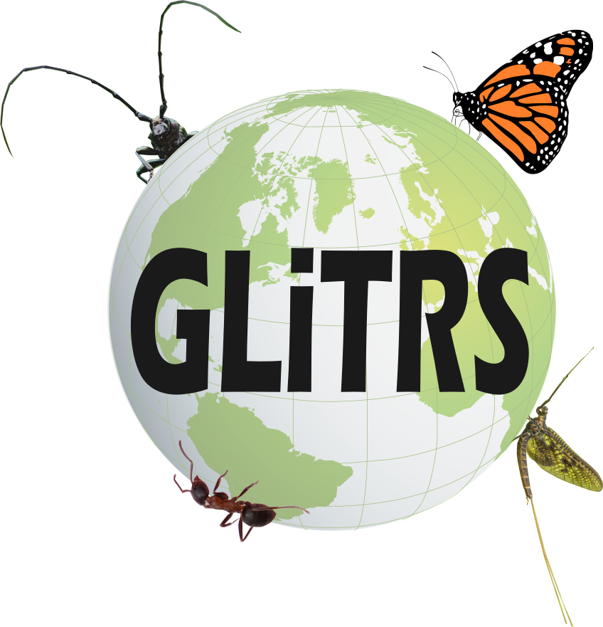

# Dynameta: A dynamic platform for ecological meta-analyses in R Shiny

***

## Introduction
Dynameta was developed as part of the [GLiTRS project](https://glitrs.ceh.ac.uk/), a cross-institutional consortium aiming to build global threat-response models to better understand and predict insect biodiversity change. 

Dynameta is a living-review (i.e. continually updateable) R Shiny platform written as an R package. This means the app can be launched by running the launch_Dynameta() function included in the R package.

Dynameta was designed for interactive ecological meta-analyses, oriented around testing the effect of anthropogenic threats on biodiversity. The platform is highly generalisable, such that it can be applied in the context of any meta-analytic PICO question concerning the effect of any IUCN threat on any taxonomic group, biodiversity metric, or geographic region. Our hope is that such software can help encourage the broader adoption of dynamic living reviews in ecology.

<br>

## Installing and using the package
Installing the package requires devtools, which can be installed and loaded by running the following code in the R console:
```
install.packages("devtools")
library(devtools)
```

Next, install and load the Dynameta package by running the following code in the R console:
```
devtools::install_github("gls21/Dynameta") # Currently won't work as need authentication token due to the repo being private
library(Dynameta)
```

Access help documentation via:
```
help(package = "Dynameta")
```

Launch the Dynameta shiny app:
```
launch_Dynameta()
```

View sample data included in the package
```
sample_data()
```

<br> 

Process for using the Dynameta app:
* Once the app has opened in your browser, you can choose whether you want to analyse the sample data included in the package or upload your own meta-analytic data to analyse.
* If you select 'Your own data', you will then be given the option to upload a file (.csv). ???Needs to contain certain columns???
* The 'Introduction' tab provides a breakdown of the data, including details of the papers and the IUCN threat(s) they investigated, and a map indicating where each data point originated from. 
* To run meta-analytic models, go to the 'Run models' tab
* Based on your interests, filter the data by IUCN threat, location, taxonomic order, or biodiversity metric the data was collected with. Then click 'Run custom model'.
* Dynameta will run a metafor meta-analytic model and produce a forest plot of the results. This includes an estimate of the overall effect size of your chosen IUCN threat on biodiversity.
* You are able to download the model object (.rds) and a file containing the results summary of the model fitting (.txt).
* View full paper details using the 'References' tab.

<br>

## Repo structure 
* R
    * launch_Dynameta.R - defines the function that can be used to launch the Dynameta app
    * sample_data.R - describes the sample data included with the package that can be analysed using the Dynameta shiny app (needed to make the dataset help documentation)
* data
    * sample_data.rda - R data file containing the sample data 
* inst
    * Dynameta_app
        * server.R - defines how the Dynameta Shiny app works (back-end development)
        * ui.R - defines the way the Dynameta Shiny app looks (front-end development)
    * images
        * GLiTRS_logo.png
* man
    * launch_Dynameta.Rd - R documentation file for the launch_Dynameta() function
    * sample_data.Rd - R documentation file for the sample data 
* DESCRIPTION - overall metadata about the Dynameta package
* NAMESPACE - specifies the functions in the Dynameta package that are exported to the user, and functions or packages that are imported by the Dynameta package

<br>

## Author name and contact 
* Grace Skinner (Research Associate Data Scientist at UKCEH)
* GraSki@ceh.ac.uk

<br>

 