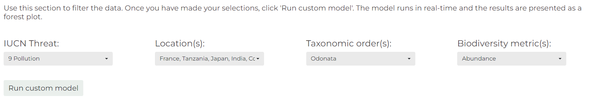

# Dynameta: A dynamic platform for ecological meta-analyses in R Shiny 

<!-- badges: start -->
[](https://github.com/gls21/Dynameta/blob/main/LICENSE.md) [](https://github.com/gls21/Dynameta/actions/workflows/R-CMD-check.yaml) [](https://zenodo.org/badge/latestdoi/577348153)
<!-- badges: end -->

***

## Table of contents
1. [Introduction](#introduction)
2. [Installing and using the Dynameta package](#installing-and-using-the-dynameta-package)
3. [Using the Dynameta Shiny app](#using-the-dynameta-shiny-app)
4. [Repo structure](#repo-structure)
5. [Author name and contact ](#author-name-and-contact)

<br>

<a name="introduction"></a>
## Introduction 
Dynameta is an [R Shiny](https://shiny.rstudio.com/) platform written as an R package. This means the app can be launched by running the launch_Dynameta() function included in the R package. The Dynameta app can then be used to run interactive meta-analytic models. 

Meta-analyses are used to quantitatively summarise evidence across studies in a systematic process. Their larger sample size (and hence power) compared to individual research studies increases the chance of detecting significant effects.

Despite representing a significant improvement upon individual studies, meta-analyses have a number of limitations which Dynameta was developed to overcome:
1. Meta-analytic results are based on a snapshot of literature at a particluar time. As a living review platform, Dynameta overcomes this by enabling results to be continually updated as new evidence becomes available.
2. Meta-analytic publications are resticted to presenting the results of the chosen questions asked by those researchers. On the other hand, Dynameta allows investigation of a range of questions based on varying interests of researchers through manipulation of the graphical user interface.

Dynameta is designed for interactive ecological meta-analyses, oriented around testing the effect of anthropogenic threats (based on the [IUCN threats classification scheme](https://www.iucnredlist.org/resources/threat-classification-scheme)) on biodiversity. Nevertheless, the code can be easily repurposed to suit a variety of meta-analytic contexts. The server.R and ui.R files that define the Dynameta Shiny app can be found in the Dynameta_app/ directory. Here on github, Dynameta_app/ can be found in the [inst/ directory](https://github.com/gls21/Dynameta/tree/main/inst/Dynameta_app). If you have installed the package, the Dynameta_app/ directory can be found directly in the package root directory, alongside the DESCRIPTION, NAMESPACE, etc. files. 

Dynameta was developed as part of the [GLiTRS](https://glitrs.ceh.ac.uk/) project, a cross-institutional consortium aiming to build global threat-response models to better understand and predict insect biodiversity change.

<br>

If you encounter any issues or bugs while installing or using Dynameta, please submit a new issue in the [issue tracker](https://github.com/gls21/Dynameta/issues) with a detailed description of the problem, including steps to reproduce it.

<br>

<a name="installing-and-using-the-dynameta-package"></a>
## Installing and using the Dynameta package 


### Installing in RStudio using devtools
Installing the package requires devtools, which can be installed and loaded by running the following code in the R console:

NOTE: If you have not installed devtools before you will need to restart your R session before installing to avoid problems. 
```
install.packages("devtools")
library(devtools)
```
If you have issues installing devtools, you could try the remotes package as an alternative. This is a lightweight replacement of the install_* functions in devtools. Install by running:
```
install.packages("remotes")
library(remotes)
```

Next, install and load the Dynameta package by running the following code in the R console:
```
devtools::install_github("gls21/Dynameta", build_vignettes = TRUE) 
library(Dynameta)

# Or if using remotes, run: 
remotes::install_github("gls21/Dynameta", build_vignettes = TRUE) 
library(Dynameta)
```
A potential reason for unsuccessful installation is the vignette not building correctly. If this is the case, remove the 'build_vignettes = TRUE' argument from the installation command. 

<br> 

### Installing in R (not RStudio) using devtools
Installing packages hosted on GitHub uses Pandoc software, which will need to be installed before installing Dynameta (Pandoc comes as standard with RStudio installation). See the documentation [here](https://pandoc.org/installing.html). Pandoc is required to build vignettes. 

Once you have Pandoc installed, run the following code (as above):
```
install.packages("devtools")
library(devtools)
devtools::install_github("gls21/Dynameta", build_vignettes = TRUE) 
library(Dynameta)
```
If Dynameta installation is unsuccessful, try removing the 'build_vignettes = TRUE' argument from the installation command. 

<br>

### Install Dynameta from source
Alternatively, you could download the Source code (tar.gz file) from the Dynameta [releases page](https://github.com/gls21/Dynameta/releases). Then run the following code in R/RStudio:
```
install.packages(path_to_file, repos = NULL, type = "source") # where path_to_file would represent the full path and file name
```

<br>

### Using Dynameta 
Once you have successfully installed Dynameta, to access help documentation, run:
```
help(package = "Dynameta")
```

Launch the Dynameta Shiny app:
```
launch_Dynameta()
```

View sample data included in the package. This contains data collected for a GLiTRS meta-analysis investigating the effect of pollution (specifically pesticide application) on dragonfly and damselfly (Odonata) abundance.
```
# View sample data
sample_data

# View description of data set
?Dynameta::sample_data
```

<br> 

<a name="using-the-dynameta-shiny-app"></a>
## Using the Dynameta Shiny app

### Introduction tab
* Once the app has opened, you can choose whether you want to analyse the sample data included in the package or upload your own meta-analytic data to analyse. By default, Dynameta uses the sample data provided in the package. 
* If you select 'Your own data', you will then be given the option to upload a .csv file. This needs to be of the same format as the sample data provided.
* The 'Introduction' tab provides a breakdown of the data that you will analyse using Dynameta, including details of the papers and the IUCN threat(s) they investigated, and a map indicating where each data point originated from.


### Run models tab
* To run meta-analytic models to investigate how different threats impact biodiversity, go to the 'Run models' tab.
* The models are multilevel meta-analytic models, run using the [metafor](https://www.metafor-project.org/doku.php/metafor) package. The models account for the non-independence of the data by specifying paper and observation identification as nested random effects.
* The effect size used to compare biodiversity is the log transformed Ratio Of Means (ROM) (also known as the log response ratio), which quantifies proportionate change between treatments.
* Based on your research question, you can filter the data by threat, location, taxonomic order, and biodiversity metric the data was collected with. 
* Make your selections, then click 'Run custom model'.



* Dynameta will run the model in real-time and produce a forest plot of the results. This includes an estimate of the overall effect size of your chosen IUCN threat on biodiversity.
* You are also able to download the model object (.rds) and a file containing the results summary of the model fitting (.txt).


### References tab
* View full paper details using the 'References' tab.


<br>

<a name="repo-structure"></a>
## Repo structure 

* .github
    * workflows
        * R-CMD-check.yaml - configures an R CMD check workflow on GitHub Actions. A build check and a unit test (written using shinytest2) are run each time code is pushed to the repository.  
* R
    * launch_Dynameta.R - defines the function that can be used to launch the Dynameta Shiny app.
    * sample_data.R - describes the sample data included with the package that can be analysed using the Dynameta Shiny app (necessary to make the help documentation for the dataset).
* data
    * sample_data.rda - R data file containing the sample data.
* inst
    * Dynameta_app
        * server.R - defines how the Dynameta Shiny app works (back-end development).
        * ui.R - defines how the Dynameta Shiny app looks (front-end development).
        * tests - directory where unit tests are stored.
            * testthat 
                * _snaps/shinytest2 - expected outputs from shinytest2.
                    * shinytest2_test-001.json 
                    * shinytest2_test-001_.png 
                * setup-shinytest2.R
                * test-shinytest2.R - re-runs the shinytest2 to check outputs match the expected outputs.
            * testthat.R - part of standard setup for testthat.
    * data_for_shinytest
        * sample_data_for_shinytest.csv - sample data in csv format.
        * sample_data_rds - sample data (in rds format) used by default by the Dynameta Shiny app.
    * images
* man
    * launch_Dynameta.Rd - R documentation file for the launch_Dynameta() function.
    * sample_data.Rd - R documentation file for the sample data. 
* tests
    * testthat/test-shinytest2_test.R - test driver script that runs the shinytest2 tests in the inst/Dynameta_app/tests directory. 
    * testthat.R - part of standard setup for testthat.
* vignettes
    * Dynameta.Rmd - R markdown document for the Dynameta package and Shiny app vignette.
* DESCRIPTION - overall metadata about the Dynameta package.
* LICENSE - declare Dynameta package as licensed.
* LICENSE.md - includes a copy of the full text of the license.
* NAMESPACE - specifies the functions in the Dynameta package that are exported to the user, and functions or packages that are imported by the Dynameta package.

<br>

<a name="author-name-and-contact"></a>
## Author name and contact 
* Grace Skinner (Research Associate Data Scientist at UKCEH)
* GraSki@ceh.ac.uk

<br>

 

<br>

This project is licensed under the terms of the MIT license.


