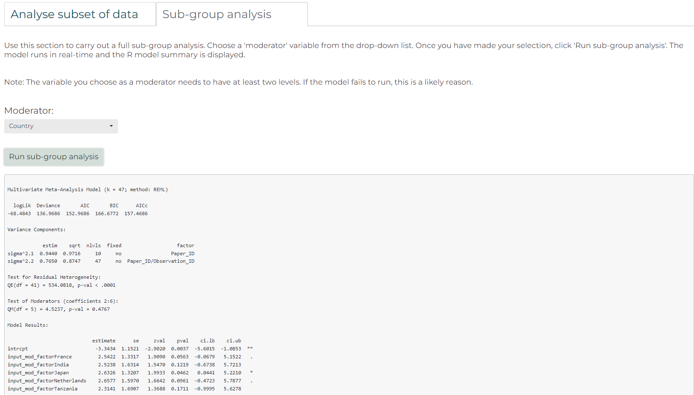

```{r, include = FALSE}
knitr::opts_chunk$set(
  collapse = TRUE,
  comment = "#>"
)
```

<br>

## Introduction to Dynameta: A dynamic platform for ecological meta-analyses in R Shiny

Dynameta is an [R Shiny](https://shiny.rstudio.com/) platform written as an R package. This means the app can be launched by running the launch_Dynameta() function included in the R package. The Dynameta app can then be used to run interactive meta-analytic models. This document introduces you to the Dynameta package, how to use it to launch the Dynameta Shiny app, and how to use the Dynameta Shiny app. 

Meta-analyses are used to quantitatively summarise evidence across studies in a systematic process. Their larger sample size (and hence power) compared to individual research studies increases the chance of detecting significant effects.

Despite representing a significant improvement upon individual studies, meta-analyses have a number of limitations which Dynameta was developed to overcome:

1. Meta-analytic results are based on a snapshot of literature at a particluar time. As a living review platform, Dynameta overcomes this by enabling results to be continually updated as new evidence becomes available.
2. Meta-analytic publications are resticted to presenting the results of the chosen questions asked by those researchers. On the other hand, Dynameta allows investigation of a range of questions based on varying interests of researchers through manipulation of the graphical user interface.

Dynameta is designed for interactive ecological meta-analyses, oriented around testing the effect of anthropogenic threats (based on the [IUCN threats classification scheme](https://www.iucnredlist.org/resources/threat-classification-scheme)) on biodiversity. Nevertheless, the code can be easily repurposed to suit a variety of meta-analytic contexts. The server.R and ui.R files that define the Dynameta Shiny app can be found in the Dynameta_app/ directory. On github, Dynameta_app/ can be found in the [inst/ directory](https://github.com/gls21/Dynameta/tree/main/inst/Dynameta_app). If you have installed the package, the Dynameta_app/ directory can be found directly in the package root directory, alongside the DESCRIPTION, NAMESPACE, etc. files. 

Dynameta was developed as part of the [GLiTRS](https://glitrs.ceh.ac.uk/) project, a cross-institutional consortium aiming to build global threat-response models to better understand and predict insect biodiversity change.

<br>

## Installing and using the Dynameta package 

<br>

### Installing in RStudio using devtools
Installing the package requires devtools, which can be installed and loaded by running the following code in the R console:
<br>
NOTE: If you have not installed devtools before you will need to restart your R session before installing to avoid problems. 
```{r, eval = FALSE}
install.packages("devtools")
library(devtools)
```

If you have issues installing devtools, you could try the remotes package as an alternative. This is a lightweight replacement of the install_* functions in devtools. Install by running:
```{r, eval = FALSE}
install.packages("remotes")
library(remotes)
```

Next, install the Dynameta package by running the following code in the R console:
```{r, eval = FALSE}
devtools::install_github("gls21/Dynameta", build_vignettes = TRUE)
```

Then load it:
```{r setup}
library(Dynameta)
library(tibble) # for previewing sample dataset 
```

Or if using remotes, run: 
```{r, eval = FALSE}
remotes::install_github("gls21/Dynameta", build_vignettes = TRUE) 
library(Dynameta)
```

A potential reason for unsuccessful installation is the vignette not building correctly. If this is the case, remove the 'build_vignettes = TRUE' argument from the installation command. 

<br>

Please see the [README](https://github.com/gls21/Dynameta/tree/main#readme) for alternative installation options. 

<br>

### Using the Dynameta package
Once you have successfully installed Dynameta, to access help documentation, run:
```{r, eval = FALSE}
help(package = "Dynameta")
```

View sample data: The Dynameta package comes with `sample_data`, which is used by default by the Dynameta Shiny app. This is an example dataset containing data collected for a GLiTRS meta-analysis investigating the effect of pollution (specifically pesticide application) on dragonfly and damselfly (Odonata) abundance. The dataset is described in full in `?Dynameta::sample_data`. 

```{r}
dim(Dynameta::sample_data)

# Print dataset as a tibble (nice way to preview dataset)
as_tibble(sample_data)
```

Launch the Dynameta Shiny app: To launch a local instance of the Dynameta Shiny app, run the following code:
<br>
The following code is not executed here as it prevents the document from knitting. 
```{r, eval = FALSE}
Dynameta::launch_Dynameta() # The function takes no arguments
```

<br>

## Process for using the Dynameta Shiny app

<br>

### 1. Introduction tab
* Once the app has opened, you can choose whether you want to analyse the sample data included in the package or upload your own meta-analytic data to analyse.
* If you select 'Your own data', you will then be given the option to upload a .csv file. This needs to be of the same format as the sample data provided.
* The 'Introduction' tab provides a breakdown of the data that you will analyse using Dynameta, including details of the papers and the IUCN threat(s) they investigated, and a map indicating where each data point originated from.

{width=150% height=150%}

<br>

### 2. Run models tab
* To run meta-analytic models to investigate how different threats impact biodiversity, go to the 'Run models' tab.
* The models are multilevel meta-analytic models, run using the [metafor](https://www.metafor-project.org/doku.php/metafor) package. The models account for the non-independence of the data by specifying paper and observation identification as nested random effects.
* The effect size used to compare biodiversity is the log transformed Ratio Of Means (ROM) (also known as the log response ratio), which quantifies proportionate change between treatments.
* Based on your research question, you can filter the data by threat, location, taxonomic order, and biodiversity metric the data was collected with. 
* Make your selections, then click 'Run custom model'.

{width=150% height=150%}

* Dynameta will run the model in real-time and produce a forest plot of the results. This includes an estimate of the overall effect size of your chosen IUCN threat on biodiversity.
* You are also able to download the model object (.rds) and a file containing the results summary of the model fitting (.txt).

{width=150% height=150%}

<br>

### 3. References tab 
View full paper details using the 'References' tab.

{width=150% height=150%}

<br>

### 4. Resources tab
Access links to guidance developed by communities of practice when conducting evidence syntheses, and other meta-analysis resources. 

<br>

## Editing the codebase
A user may wish to edit the codebase to better suit their needs. Here we document an example of how to add the option to perform full sub-group analysis on the data (in addition to the current approach taken by Dynameta, which is to complete a meta-analysis on a subset of the data).
For full sub-group analysis, several separate random-effects meta-analyses are conducted (one for each subgroup) and the effects of the subgroups are compared using a statistical test. To run a meta-analytic model with sub-group analysis using metafor, you can add a categorical variable as a moderator. 

<br>

To achieve this, you need access to the scripts that need to be edited. Possible options are to fork the [Dynameta GitHub repo](https://github.com/gls21/Dynameta), or download the repo as a zipped file. 

Next you will need to open the ui.R and server.R files that make up the Dynameta shiny app. These are in the [/inst/Dynameta_app/](https://github.com/gls21/Dynameta/tree/main/inst/Dynameta_app) directory.

The following chunks of code need to be added to the ui.R and server.R files at the line numbers specified. NOTE: The line numbers correspond to the line numbers in the Vxxx release of Dynameta code. 

<br>

### ui.R script

#### 1
Section: Modelling tab

Line 239

<br>

Insert the code beneath this line of code:
```{r, eval=FALSE}
shiny::tabPanel("Run models",
```
And above these lines of code:
```{r, eval=FALSE}
# ----------------------------------------------------------------------------------------------------------------------
# Title to show at top of tab
p(h2(tags$b("Run models"))),
```

<br>

Code to add:
```{r, eval=FALSE}
# Make tab buttons within this tab bigger
tags$style(HTML("
                    .tabbable > .nav > li > a {
                    width: 400PX; font-size: 30px
                    }
                  ")),

```

<br>

#### 2
Section: Modelling tab

Line 256

<br>

Insert the code beneath these lines of code:
```{r, eval=FALSE}
p(h5("The effect size used to compare biodiversity is the log transformed Ratio Of Means (ROM) (also known as the log response ratio),
which quantifies proportionate change between treatments.")),

```
And above these lines of code:
```{r, eval=FALSE}
tags$br(),
tags$hr(),

# -----------------------------------------------------------------------------------------------------------------------

# ===========================================================================================================

### Running custom models
```

<br>

Code/text to alter/add:
```{r, eval=FALSE}
# Alter this text to describe difference between subset analysis and subgroup analysis 

## Comment out this original text ##
#p(h5("Based on your research question, you can filter the data by threat, location, taxonomic order, and biodiversity metric.")),

# Add this text 
p(h5("There are two options available for analysis:")),

h5(tags$ol(
  tags$li("Filter the data by threat, location, taxonomic order, and biodiversity metric
                            and run a meta-analytic model on this subset of data."),
  tags$li("Choose a moderator variable and carry out a full sub-group analysis 
                            (meta-regression with a categorical predictor) to see if the pooled effect sizes
                            found in these subgroups differ from each other.")
)),

```

<br>

#### 3
Section: Modelling tab

Line 269

<br>

Insert the code beneath these lines of code:
```{r, eval=FALSE}
# ===========================================================================================================

### Running custom models

# ===========================================================================================================

```
And above these lines of code:
```{r, eval=FALSE}
h5("Use this section to filter the data. Once you have made your selections, click 'Run custom model'. 
    The model runs in real-time and the results are presented as a forest plot."),

```

<br>

Code to add:
```{r, eval=FALSE}
### Include 2 tabs within the 'Run models' tab
# One for analysing subset of data (as Dynameta did originally)
# One for full sub-group analysis 

shiny::tabsetPanel(type = "tabs",
                   
                   # ------------------------------------------------------------------------------------------------------------------------
                   
                   ### Analyse subset of data tab 
                   
                   # ------------------------------------------------------------------------------------------------------------------------
                   
                   shiny::tabPanel("Analyse subset of data",
                                   
                                   tags$br(),
     
```

<br>

#### 4
Section: Modelling tab

Line 421

<br>

Insert the code beneath these lines of code:
```{r, eval=FALSE}
# download button for downloading forest plot
shiny::downloadButton(outputId = "download_forest_plot",
                      label = "Download forest plot",
                      style='font-size:125%')

                   )

),

tags$br(),
tags$br()

```
And above these lines of code:
```{r, eval=FALSE}
), # close modelling tab


# ===============================================================================================================================
# ===============================================================================================================================

# References tab
```

<br>

Code to add:
```{r, eval=FALSE}

                   ), # Close 'Analyse subset of data' tab

# ------------------------------------------------------------------------------------------------------------------------

### Sub-group analysis tab 

# ------------------------------------------------------------------------------------------------------------------------

shiny::tabPanel("Sub-group analysis",
                
                tags$br(),
                
                h5("Use this section to carry out a full sub-group analysis. 
                    Choose a 'moderator' variable from the drop-down list.
                    Once you have made your selection, click 'Run sub-group analysis'. 
                    The model runs in real-time and the R model summary is displayed."),
                
                tags$br(),
                
                h5("Note: The variable you choose as a moderator needs to have at least two levels.
                    If the model fails to run, this is a likely reason."),
                
                tags$br(),
                
                
                # Add parts for sub-group analysis
                shiny::fluidRow(
                  
                  shiny::column(
                    12,
                    
                    # Select input for choice of moderator
                    h4(shiny::uiOutput("reactive_moderator_choice")),
                    
                    tags$br(),
                    
                    # include action button to run model once inputs have been selected
                    shiny::actionButton("run_sub_group_analysis", "Run sub-group analysis", style='font-size:125%'),
                    
                    tags$br(),
                    tags$br(),
                    
                    # Render output of model 
                    shinycssloaders::withSpinner(shiny::verbatimTextOutput(outputId = "subgroup_model_output")),
                    
                    tags$br(),
                    tags$br(),
                    tags$br(),
                    tags$br()
                    
                  ),
                  
                ),
                
                
), # Close 'Sub-group analysis' tab


# ------------------------------------------------------------------------------------------------------------------------

), # close tabs within 'Run models' tab       
```

<br>

### server.R script

#### 1
Section: Run models tab

Line 579

<br>

Insert the code beneath these lines of code:
```{r, eval=FALSE}
# Download forest plot button
output$download_forest_plot <- shiny::downloadHandler(
  
  filename = function() {
    paste0("forest_plot", base::Sys.Date(), ".png", sep="")
  },
  content = function(file) {
    grDevices::png(file, width = 1500, height = 1000)
    metafor::forest(custom_model(),
                    xlim = c(-12, 8), # horizontal limits of the plot region
                    ilab = base::cbind(Treatment), # add in info on treatment used
                    ilab.xpos = -8, # position treatment labels
                    order = Treatment, # Order results by treatment
                    cex = 1.5,
                    col = "#0483A4", # change colour of overall effect size diamond using CEH hero colour
                    mlab = "RE Model for All Studies",
                    header = "Author(s) and Year")
    grDevices::dev.off()
  }
  
)
```
And above these lines of code:
```{r, eval=FALSE}
# ----------------------------------------------------------------------------------------------------------------

# =================================================================================================================
# =================================================================================================================

##### References tab

```

<br>

Code to add:
```{r, eval=FALSE}
## Make reactive moderator (for sub-group analysis) choices
output$reactive_moderator_choice <- shiny::renderUI({
  shinyWidgets::pickerInput(inputId = "moderator_choice",
                            label = "Moderator:",
                            choices = base::names(data()),
                            selected = "Country",
                            multiple = FALSE) # add actions box for selecting/de-selecting all options
})

### Run model

# Run sub-group analysis model once the run model button has been pressed
sub_group_analysis <- shiny::eventReactive(input$run_sub_group_analysis, {
  
  subgroup_analysis_data <- data() 
  
  # Try to run the model. If doesn't work, tell user to include more data or view error message.
  base::tryCatch(
    expr = {
      
      # add small value to control and treatment columns
      subgroup_analysis_data$Treatment_Mean <- subgroup_analysis_data$Treatment_Mean + 0.1
      subgroup_analysis_data$Control_Mean <- subgroup_analysis_data$Control_Mean + 0.1
      
      # calculate effect sizes from number, mean, and SD - data needs to be in wide format
      # Adds yi and vi columns to data
      subgroup_analysis_data <- metafor::escalc(measure = "ROM", # log transformed ratio of means (i.e. log response ratio)
                                                n1i = subgroup_analysis_data$Treatment_N,
                                                n2i = subgroup_analysis_data$Control_N,
                                                m1i = subgroup_analysis_data$Treatment_Mean,
                                                m2i = subgroup_analysis_data$Control_Mean,
                                                sd1i = subgroup_analysis_data$Treatment_error,
                                                sd2i = subgroup_analysis_data$Control_error,
                                                slab = paste(Paper_ID), # slab adds study labels which will help when we make forest plot
                                                data = subgroup_analysis_data)
      
      # Make the chosen moderator a factor
      input_mod_factor <- as.factor(subgroup_analysis_data[, input$moderator_choice])
      
      # Run metafor model
      sub_group_analysis_model <- metafor::rma.mv(yi, vi, # effect sizes and corresponding variances
                                                  random = ~ 1 | Paper_ID/Observation_ID, # specify random-effects structure of model
                                                  mods = ~ input_mod_factor, # specify the user's chosen moderator
                                                  data = subgroup_analysis_data)
      
      sub_group_analysis <- sub_group_analysis_model
      
      
    }, error = function(e) {
      
      # If model does not successfully run, stop the process and return this error message
      base::stop(shiny::safeError(paste0("This model failed to run. This may be due to insufficient data for this model to run, but please see the R error message: ", e)))
    })
  
})

### Render the model summary output
output$subgroup_model_output <- shiny::renderPrint({
  
  shiny::req(sub_group_analysis())
  
  base::summary(sub_group_analysis())
  
})

```

<br>

To test the app, click the 'Run App' button in RStudio, or use the 'shiny::runApp()' command. 

<br>

Adding these chunks of code results in an additional tab for sub-group analysis in the 'Run models' tab of the app. Here, you are given the option to chose a moderator, and then click 'Run sub-group analysis' to run the meta-analytic model and produce the R model summary. 

{width=150% height=150%}

<br>

Users can build on the example here around sub-group analysis, add additional features, or alter other parts of the app as desired to suit their needs. 

<br>

