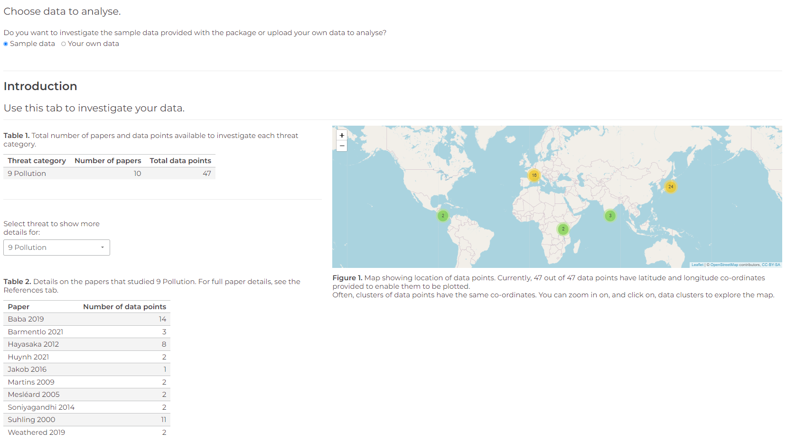
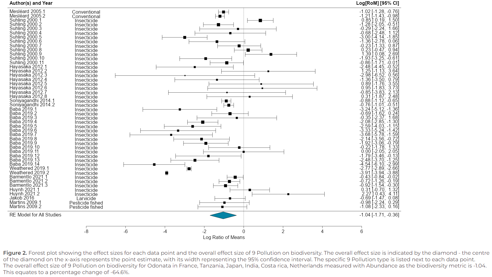
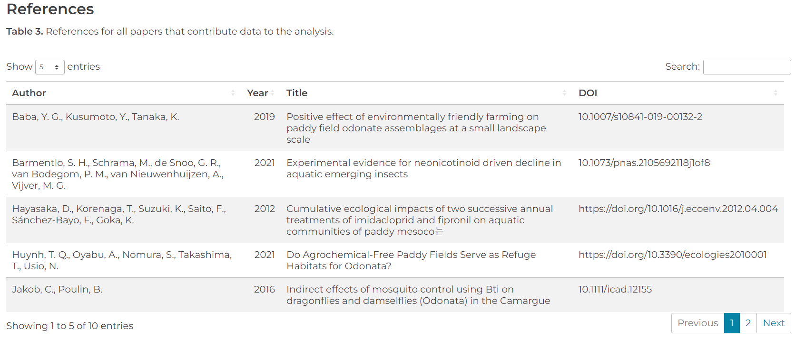

```{r, include = FALSE}
knitr::opts_chunk$set(
  collapse = TRUE,
  comment = "#>"
)
```

## A dynamic platform for ecological meta-analyses in R Shiny

Dynameta is an [R Shiny](https://shiny.rstudio.com/) platform written as an R package. This means the app can be launched by running the launch_Dynameta() function included in the R package. The Dynameta app can then be used to run interactive meta-analytic models. This document introduces you to the Dynameta package, how to use it to launch the Dynameta Shiny app, and how to use the Dynameta Shiny app. 

Meta-analyses are used to quantitatively summarise evidence across studies in a systematic process. Their larger sample size (and hence power) compared to individual research studies increases the chance of detecting significant effects.

Despite representing a significant improvement upon individual studies, meta-analyses have a number of limitations which Dynameta was developed to overcome:

1. Meta-analytic results are based on a snapshot of literature at a particluar time. As a living review platform, Dynameta overcomes this by enabling results to be continually updated as new evidence becomes available.
2. Meta-analytic publications are resticted to presenting the results of the chosen questions asked by those researchers. On the other hand, Dynameta allows investigation of a range of questions based on varying interests of researchers through manipulation of the graphical user interface.

Dynameta is designed for interactive ecological meta-analyses, oriented around testing the effect of anthropogenic threats (based on the [IUCN threats classification scheme](https://www.iucnredlist.org/resources/threat-classification-scheme)) on biodiversity. Nevertheless, the code can be easily repurposed to suit a variety of meta-analytic contexts. The server.R and ui.R files that define the Dynameta Shiny app can be found in the Dynameta_app/ directory. On github, Dynameta_app/ can be found in the [inst/ directory](https://github.com/gls21/Dynameta/tree/main/inst/Dynameta_app). If you have installed the package, the Dynameta_app/ directory can be found directly in the package root directory, alongside the DESCRIPTION, NAMESPACE, etc. files. 

Dynameta was developed as part of the [GLiTRS](https://glitrs.ceh.ac.uk/) project, a cross-institutional consortium aiming to build global threat-response models to better understand and predict insect biodiversity change.

<br>

Installing the package requires devtools, which can be installed and loaded by running:
```{r, eval = FALSE}
install.packages("devtools")
library(devtools)
```

Next, install the Dynameta package by running:
```{r, eval = FALSE}
devtools::install_github("gls21/Dynameta", build_vignettes = TRUE)
```

Then load the package by running:
```{r setup}
library(Dynameta)
library(tibble) # for previewing sample dataset 
```

For access to help documentation, run:
```{r, eval = FALSE}
help(package = "Dynameta")
```

## Data: sample_data
The Dynameta package comes with `sample_data`, which is used by default by the Dynameta Shiny app. This is an example dataset containing data collected for a GLiTRS meta-analysis investigating the effect of pollution (specifically pesticide application) on dragonfly and damselfly (Odonata) abundance. The dataset is described in full in `?Dynameta::sample_data`. 

```{r}
dim(Dynameta::sample_data)

# Print dataset as a tibble (nice way to preview dataset)
as_tibble(sample_data)
```

## Launch the Dynameta Shiny app
To launch a local instance of the Dynameta Shiny app, run the following code:
<br>
The following code is not executed here as it prevents the document from knitting. 
```{r, eval = FALSE}
Dynameta::launch_Dynameta() # The function takes no arguments
```

## Process for using the Dynameta Shiny app
### 1. Introduction tab
* Once the app has opened, you can choose whether you want to analyse the sample data included in the package or upload your own meta-analytic data to analyse.
* If you select 'Your own data', you will then be given the option to upload a .csv file. This needs to be of the same format as the sample data provided.
* The 'Introduction' tab provides a breakdown of the data that you will analyse using Dynameta, including details of the papers and the IUCN threat(s) they investigated, and a map indicating where each data point originated from.

{width=150% height=150%}

### 2. Run models tab
* To run meta-analytic models to investigate how different threats impact biodiversity, go to the 'Run models' tab.
* The models are multilevel meta-analytic models, run using the [metafor](https://www.metafor-project.org/doku.php/metafor) package. The models account for the non-independence of the data by specifying paper and observation identification as nested random effects.
* The effect size used to compare biodiversity is the log transformed Ratio Of Means (ROM) (also known as the log response ratio), which quantifies proportionate change between treatments.
* Based on your research question, you can filter the data by threat, location, taxonomic order, and biodiversity metric the data was collected with. 
* Make your selections, then click 'Run custom model'.

{width=150% height=150%}

* Dynameta will run the model in real-time and produce a forest plot of the results. This includes an estimate of the overall effect size of your chosen IUCN threat on biodiversity.
* You are also able to download the model object (.rds) and a file containing the results summary of the model fitting (.txt).

{width=150% height=150%}

### 3. References tab 
View full paper details using the 'References' tab.

{width=150% height=150%}


